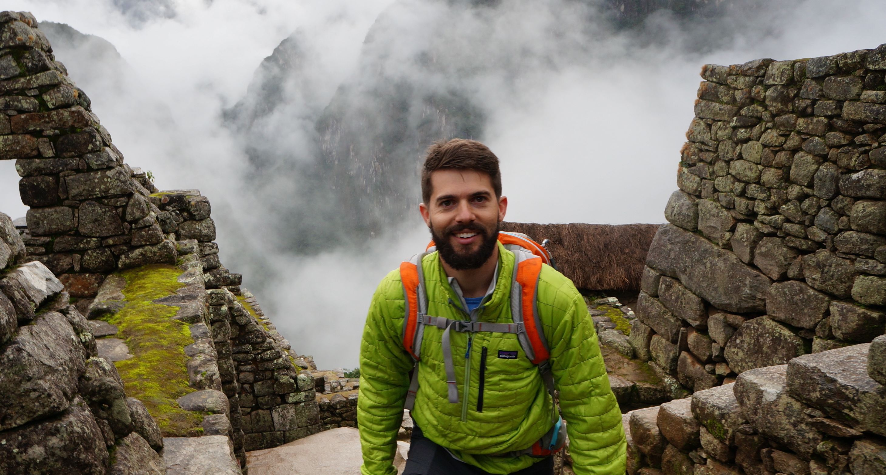

pro·​vo·love |  \ prō-vō-ˈləv

🧡 Striving to create lovable products by embracing change and focusing on the present

## I'm Luke Vance 

I'm a product manager, builder, investor and optimist. I'm also a dad, a long-distance runner, and a part-time after-hours developer tooling explorer. 

## How I Operate

I love new challenges, open spaces full of risk and unknown. Processes and constraints help breed innovative environments but I thrive in a moderate level of chaos.

With a multi-cultural, interdisciplinary background, I believe in the power of ethnography and well-researched design, but magical experiences come from building rapidly, constantly experimenting and iterating intentionally. 

By default I assume the best in people and that any problem can be solved. Our world is facing some ominous challenges, but I believe building the best possible tools for builders can ultimately lead to even more surprising solutions.

---

> I was given the nickname "Provo" when I became the first of my teammates to achieve the *provisional* qualifying standards for the Track and Field National Championships during my freshman year in college. Though I did not make it to the championships that year, I did eventually become a 5-time All-American and the nickname and the concept stuck. **Environments are constantly changing, expect evolution and plan to adapt.**