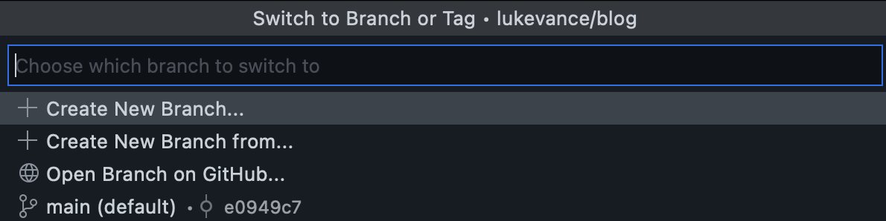

Ok, I didn't actually build this site on my smartphone. I have an iPhone mini, which I love, but typing all of this on that screen would be infuriating. But I could have! I built it entirely from a web browser on a chromebook. But follow this guide and you absolutely can build this website or probably a better one from your phone. And may I add, no coding experience is required!

"Cool, Luke, have you ever heard of Wordpress? Or Wix, or Webflow or any other website builder out there?"

Fair enough. Yes, I have. But while those systems are awesome and have many benefits, I  wanted to build a website that wouldn’t be locked into a specific platform or provider and one I could manage with proper developer tooling. One that *could* become a more capable web app someday if I wanted it to be. **I wanted to see how hard it would be to build and deploy a website from source code to the cloud without leaving the browser**. 

I still hear the sharpening of pitchforks by the hordes of people who have built massively popular and capable apps with drag and drop frameworks. They are likely much more successful than I'll ever be and honestly I’m super happy for them. That’s not the point, I’ll write something soon on the pros and cons of no-code vs all-code and what’s in between.

# Background

I started this project because I wanted to update my personal site and add a blog page to it. Sounds simple enough, but when I tried to `npm install` on my outdated chromebook (I’ll write more about developing on a Chromebook later) I started to run into a cascading error-upgrade-error cycle. This problem is generally infuriating to me and although I understand why it’s a problem I strongly feel that there needs to be tools that solve it. For new developers and seasoned engineers alike but especially for those early on their journey. 

I've used Gatsby as a static site generator before and had even used this nice little “deploy to Netlify” button before, so that was my initial thought. When I got to the Gatsby Templates page though, I learned that all their templates are now designed for deploying to the Gatsby Cloud. Awesome another cloud! Actually, I think this is really cool, however they don’t appear to have a free tier and I already have a Netlify account so I decided I’d save the Gatsby Cloud review for another day. I did wonder if deploying with Netlify would be more difficult now, but I figured I’d start there.

So my new project criteria were:

1. Own and manage the code - the source code needs to be in my own github repository
2. Built on [React](www.reactjs.com) - React is the frontend development framework I prefer/know best
3. Integrated data sources - import posts from Notion or let users comment or something else fun

Sound fun? Read on.

## Prerequisites

- Web browser & internet connection
- Github account - free
- Netlify account - free
- **No coding experience** - but to add blogs to the site you’ll need either simple Markdown knowledge or a Markdown editor (I like this one) - [https://stackedit.io/](https://stackedit.io/)

# Process

## Step 1: Pick a template

Technically, this would work just fine by creating a purely empty repository and writing all the files needed by hand. But why on earth would we do that when there are thousands or maybe millions of developers who’ve contributed open source examples and templates to start from?

There are lots of places to find great templates these days. Most static site generators out there have a few of their own. Since I’ve used Gatsby before and at the time it played well with Netlify, I went that route and soon came across [this beauty](https://www.gatsbyjs.com/starters/LekoArts/gatsby-starter-minimal-blog).

If we were doing this outside of a browser we could install the Gatsby CLI and use the template as a starter. But thankfully Github has pretty neat [templating functionality](https://docs.github.com/en/repositories/creating-and-managing-repositories/creating-a-repository-from-a-template) built in, which LekoArts was nice enough to set up, so all we need to do 

1. log in to Github 
2. head over to the [source code](https://github.com/LekoArts/gatsby-starter-minimal-blog) 
3. and click on the “Use this template” button.


## Step 2: Deploy to Netlify

Similarly to the last step, there are several free Static Site servers these days. Technically this can even be down from Github using the Github pages feature, but since we’re not going to be testing this site locally, Netlify will help us [preview changes](https://www.netlify.com/products/deploy-previews/) by deploying a temporary version of the site for any commit or change we want to test.

1. Log in to Netlify
2. Under the “Sites” section, click “Add new site” and select “Import an existing project”


1. If you haven’t already, you’ll need to log in to Github so that Netlify can find the template we created in step 1. 
2. After authorizing, Netlify will ask you to pick a repository, and after finding the template from step 1, and moving on to the final setup step you should see this nice little message:


Look at that! How easy can this be?

1. Last step, click that big beautiful deploy button and check out your fancy new website!

## Step 3: Make changes on Github.dev

At this point, our website should look almost exactly, if not exactly, like the demo site of the template we picked: **[Demo Website](https://minimal-blog.lekoarts.de/)**


So let’s make this thing our own! This is where we we’ll write some content and edit a bit of the code. Don’t worry, we’re doing absolutely nothing complicated here so like I said before, **no coding experience is required.**

Typically the way to edit a website like this would be to “clone” or download the source code repository onto your computer. But that doesn’t work on a smartphone (at least not on most mobile operating systems or not yet). So instead, we’re going to use a fun new Github feature.

From your cloned Github repository (e.g. [github.com/lukevance/blog](http://github.com/lukevance/blog)) simply push the `.` key or if that doesn’t work, replace `.com` with `.dev` in the url (e.g. [github.**dev**/lukevance/blog](http://github.dev/lukevance/blog)) and hit enter. You should see the page reload to look something like this:


Woah! A whole lightweight version of [VS Code](https://code.visualstudio.com) right in the browser?! Pretty neat.

From here we can completely rewrite the content, styles and code of this website. Not only that, we can actually add new packages to the website. Simply by adding them to the `package.json` file Netlify will pick up the new packages and install them when our site gets deployed. Sure, we’ll have to wait for it to be deployed to test the changes but that’s where Netlify’s [Deploy Previews](https://docs.netlify.com/site-deploys/deploy-previews/) and Branch Deploys become super handy. 

### *Recommended: Create a dev branch*

From the bottom of your page, click the branch name (should be `main` or `master`). This will bring up a small menu at the top of the page. Click “Create New Branch…” and type `dev`. This will help us preview changes and not crash the live website before submitting changes to the live or default branch (should be `main`).

<p align="middle">
  
  
</p>

### Update Site Metadata

One of the cool things Gatsby does is collects data for your website at compile time, so we can update lots of the website's info simply by editing the first few lines of the `gatsby-config.js` file.

```jsx
// gatsby-config.js

module.exports = {
  siteMetadata: {
    // You can overwrite values here that are used for the SEO component
    // You can also add new values here to query them like usual
    // See all options: https://github.com/LekoArts/gatsby-themes/blob/main/themes/gatsby-theme-minimal-blog/gatsby-config.js
    siteTitle: `Provolove`,
    siteTitleAlt: `Provolove - Thoughts on building meaningful software`,
    siteHeadline: `Provolove blog - based on a Gatsby Theme from @lekoarts`,
    siteUrl: `https://www.provolove.com`,
    siteDescription: `Just a little about me and my thoughts on tech`,
    siteLanguage: `en`,
    siteImage: `/banner.jpg`,
    author: `@lukealanv`,
  },
```

Right below the `siteMetadata` section, update the template website's sections and external links:

```jsx
// gatsby-config.js

plugins: [
    {
      resolve: `@lekoarts/gatsby-theme-minimal-blog`,
      // See the theme's README for all available options
      options: {
        navigation: [
          {
            title: `Blog`,
            slug: `/blog`,
          },
          {
            title: `About`,
            slug: `/about`,
          },
        ],
        externalLinks: [
          {
            name: `Twitter`,
            url: `https://twitter.com/lukealanv`,
          },
          {
            name: `LinkedIn`,
            url: `https://www.linkedin.com/in/lukevance/`,
          },
        ],
      },
    },
    ...
]
```

### Add Content

The rest of the editing we’re going to do is in Markdown, a simple text styling format. If you don’t know Markdown, you can use an editor like this one or even a tool like Notion and then copy and paste content into the [Github.dev](http://Github.dev) editor and it will automagically convert to Markdown.

All that's needed now is to update or replace the files in the /pages and /posts folders. Once that's done commit the changed files and merge the `dev` branch into `main` and voila! Netlify takes care of the rest and deploys your app.