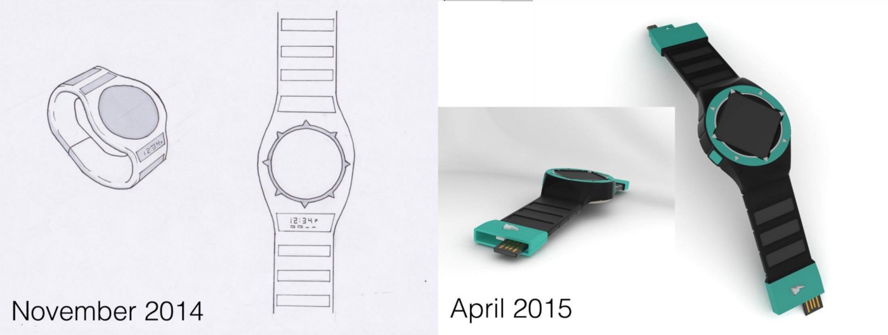
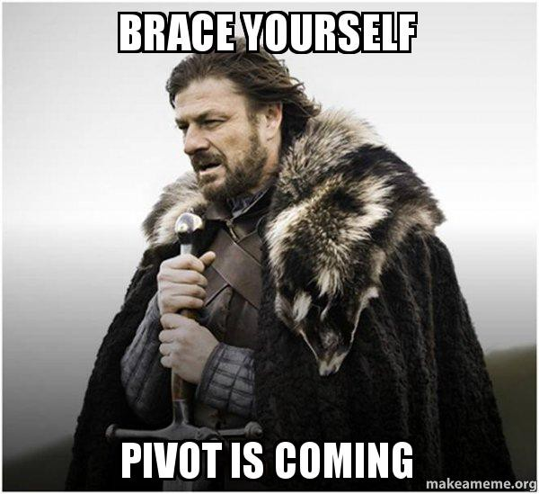

> *This post originally appeared on [Medium](https://medium.com/@lukevance/lessons-from-a-failed-startup-part-0-273e4fdbdab6) in August of 2016*

## As I walked down Pine St in downtown Boulder, on a warm afternoon in May, I knew it was over.

There were still 4 days left in our [IndieGogo campaign](https://www.indiegogo.com/projects/qband-solar-watch-and-smartphone-charger), but we had only raised about a quarter of our $30,000 goal. And now for the first time, it hit me that $30k was probably only **10%** of what we really needed to take Hemera Project on the next step of its startup journey.

We knew that our goal was low, but our hope was that if we could crowdfund that amount on IndieGogo, our investors would see the traction as a good sign, and make up the difference of what we needed. But on that day in the middle of Boulder Startup Week as I was desperately promoting our campaign at any event I could, I had stepped in to a talk on IoT and listened to the brilliant Brian Baker say, among many things, that a seed round for a tech hardware company should never be less than $250,000. I had pushed forward on the belief that creativity, hard work, and being scrappy could keep costs down and get us off the ground. But at this moment, I started questioning everything.

Did we totally underestimate the work and money it would take to launch a consumer product?

Did we spend our resources in entirely the wrong areas?

Could we raise another $200k, even if we wanted to?

Did we need to “pivot”*?

 **pivot: startup speak for 'give up and try something else'*

A week later, our campaign had ended unsuccessfully and I was gloomily glancing from a stack of bills on one side of my desk to the proposals and estimated costs for our next phase of development on the other side. After scratching out numbers on a legal pad several times, I called my co-founder and by the end of that conversation we decided that unless any of our investors were strongly opposed, Hemera Project would pay its debts with the last of its funds and close up shop.

In retrospect, it was one of the better decisions we made during our tenure as startup founders.

At the time I really thought that Hemera could make a comeback someday, maybe when the US Patent and Trademark Office finally awarded us the patent we had worked so hard to get. Or maybe when a Billionaire philanthropist dug us up from an archived database of failed crowdfunding campaigns and begged us to take $10M to finish what we started.

Whatever the case, I finished analysis of all our advertising and crowdfunding analytics and wrote up summaries in the weeks that followed. During the whirlwind of the year I tried to launch a startup, I was constantly overwhelmed with maintaining progress. Every time I heard someone tell me “You must be learning so much!” I'd nod, laugh and say “There's a lot to learn!” But in reality I couldn't put a finger on any single thing I could label as a lesson learned.

Finally, now that over a year has gone by, and I've had numerous conversations with successful entrepreneurs and aspiring entrepreneurs, I can say that there were definitely several concrete lessons I learned through my failed startup. Some as simple as “get feedback all the time” and others less intuitive, like how I think you should give lots of equity away (to the right people).

But rather than just jump in and start ranting, (Really? What has this whole post been?) I figured I might as well take my own advice and get some feedback. So here are the topics I feel that I learned at least something about, and could be helpful to others, please vote on the one that you most want to hear about and over the next 3 weeks I'll write an in depth post on my lessons learned from the most popular topics.

Finding a Co-Founder and Giving Them Equity
Protecting Your Idea and Intellectual Property
Raising Money and Getting Started
Branding, Marketing, and “Going Viral”
Minimum Viable Products vs. the “First Impression Approach”